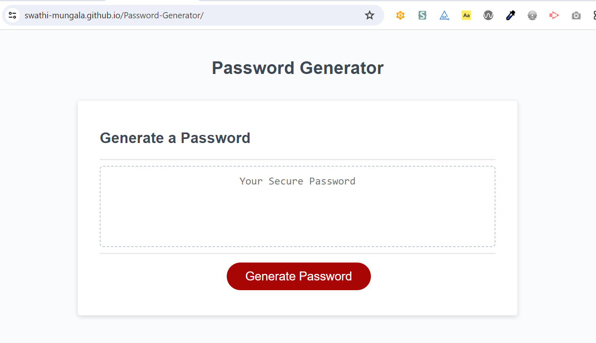
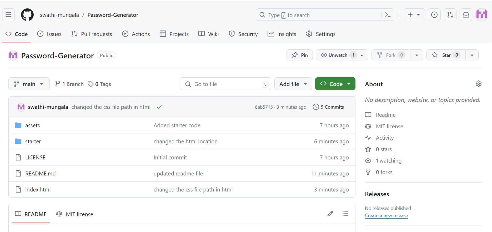

# Password-Generator
Welcome to password generator. Here you can generate the password on click of "Generate Password" button. you are asked whether to include lowercase, uppercase, special and numeric characters to generate a dynamic/random password everytime you click on "Generate Password" button. On confirming the characters the password is generated and displayed on screen.

## Acceptance criteria
* Generate a password when the button is clicked
  * Present a series of prompts for password criteria
    * Length of password
      * At least 8 characters but no more than 128.
    * Character types
      * Lowercase
      * Uppercase
      * Numeric
      * Special characters ($@%&*, etc)
  * Code should validate for each input and at least one character type should be selected
  * Once prompts are answered then the password should be generated and displayed in an alert or written to the page

## website screenshot
- Here is the screenshot of Password-Generator website.

## Live site link
Here is the link of Password-Generator website
[Live site link](https://swathi-mungala.github.io/Password-Generator/)

## Github repo link
Here is the link of Password-Generator Github repo
[Github repo](https://github.com/swathi-mungala/Password-Generator)

## Installation
Clone the repository from github to your local using HTTPS or SSH or Github CLI and then run it in local.

## Usage
N/A

## Credits

N/A

## License

[MIT](https://choosealicense.com/licenses/mit/)

## Badges

N/A

## Features

N/A

## How to Contribute

N/A

## Tests

N/A